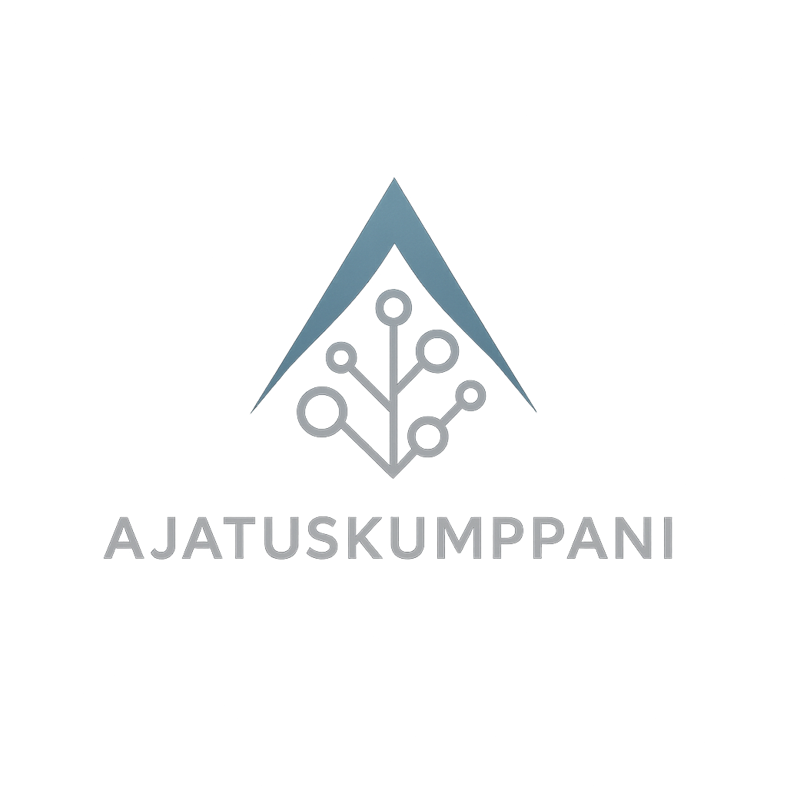

# Ajatuskumppani – The Open Core AI Project by Pinnacore

<p align="center">
  
</p>

<p align="center">
  <strong>Suomalainen avoin tekoäly, joka oppii tuntemaan sinut.</strong>
</p>

<p align="center">
  <a href="https://discord.gg/YOUR_INVITE_LINK"></a>
  <a href="https://github.com/pinnacore-ai/ajatuskumppani/stargazers"></a>
  <a href="LICENSE"></a>
</p>

---

**Ajatuskumppani** (in English: **ThoughtMate OS**) is an open-source, community-driven AI platform built on three core principles:

1.  **Open Source**: Built on a foundation of open-source models and code.
2.  **User Control**: You control your data, memories, identity, and AI persona.
3.  **Decentralization**: Powered by a DePIN model, node-based computing, and a token economy.

Our mission is to create the first European user-centric AI Operating System that combines privacy, transparency, and intelligence. Ajatuskumppani is not just an AI assistant; it's a digital soul that learns from you and grows with you.

---

## ✨ Project Components

The Ajatuskumppani ecosystem consists of several key components:

| Component | Description | Repository | License |
|---|---|---|------|
| **AjatusCore** | The core language model (LLM) and AI engine. | [`ajatus-core`](https://github.com/Pinnacore-AI/ajatus-core) | Apache 2.0 |
| **AjatusNode** | The decentralized agent and compute node. | [`ajatus-node`](https://github.com/Pinnacore-AI/ajatus-node) | AGPL 3.0 |
| **AjatusServer** | The main API and orchestrator for all services. | [`ajatus-server`](https://github.com/Pinnacore-AI/ajatus-server) | AGPL 3.0 |
| **AjatusUI** | The cross-platform user interface (React Native). | [`ajatus-ui`](https://github.com/Pinnacore-AI/ajatus-ui) | Apache 2.0 |
| **AjatusMemory** | The vector memory and learning profile model. | [`ajatus-memory`](https://github.com/Pinnacore-AI/ajatus-memory) | Apache 2.0 |
| **AjatusToken** | The `AJT` token and blockchain integration. | [`ajatus-token`](https://github.com/Pinnacore-AI/ajatus-token) | MIT |
| **AjatusAgents** | Autonomous agents for various tasks. | [`ajatus-agents`](https://github.com/Pinnacore-AI/ajatus-agents) | AGPL 3.0 |

## ⚙️ Tech Stack

- **Backend**: Python, FastAPI, PostgreSQL, Redis, vLLM
- **Frontend**: React Native, TypeScript, Tailwind CSS
- **AI**: Mistral 7B, pgvector, FAISS, LangChain
- **DevOps**: Docker, GitHub Actions, Debian
- **Blockchain**: Solidity, Hardhat, ERC-20

## 📚 Documentation

Full documentation for each component can be found in their respective directories. 

- [**Getting Started Guide**](GETTING_STARTED.md) - Quick start for developers
- [**FAQ**](FAQ.md) - Frequently asked questions
- [**Project Structure & Architecture**](PROJECT_STRUCTURE.md) - Detailed component overview
- [**Development Roadmap**](ROADMAP.md) - 4-phase development plan
- [**Token Economics**](docs/TOKEN_ECONOMICS.md) - AJT token details
- [**Technical Architecture**](docs/architecture/TECHNICAL_ARCHITECTURE.md) - System design
- [**Contribution Guidelines**](CONTRIBUTING.md) - How to contribute

## 🚀 Getting Started

### Quick Start with Docker Compose

```bash
git clone https://github.com/pinnacore-ai/ajatuskumppani.git
cd ajatuskumppani
docker-compose up -d
```

This will start all services. Access the API at http://localhost:8000 and the UI at http://localhost:3000.

For detailed setup instructions, see the [Getting Started Guide](GETTING_STARTED.md).

### Manual Setup

Clone individual components and follow their README instructions:

```bash
# Backend API
git clone https://github.com/pinnacore-ai/ajatus-server.git

# Frontend UI
git clone https://github.com/pinnacore-ai/ajatus-ui.git

# LLM Core
git clone https://github.com/pinnacore-ai/ajatus-core.git
```

## 🤝 Community & Contribution

This is a community-driven project. We welcome contributions of all kinds, from code and documentation to design and testing.

- **Join our [Telegram](https://t.me/ajatuskumppani)** - Main community hub
- **Join our [Discord](https://discord.gg/z53hngJHd)** - Technical discussions
- **Read our [Contribution Guidelines](CONTRIBUTING.md)** to get started
- **Check out the [open issues](https://github.com/Pinnacore-AI/ajatuskumppani/issues)** to find a task to work on
- **Read the [FAQ](FAQ.md)** for common questions

## 🗺️ Roadmap

We're currently in **Phase 1: Foundation & MVP** (0-3 months). See our [detailed roadmap](ROADMAP.md) for the full development plan:

- **Phase 1** (0-3 months): Core infrastructure and MVP
- **Phase 2** (3-6 months): Decentralization and learning
- **Phase 3** (6-12 months): Expansion and community
- **Phase 4** (12+ months): The Open AI Network

## 📄 License

The Ajatuskumppani project uses a multi-license model. Each component has its own license, clearly specified in its respective directory. The main repository is licensed under the **MIT License**.

See [LICENSE](LICENSE) for details.

---

## 📧 Contact

- **Telegram**: https://t.me/ajatuskumppani
- **Discord**: https://discord.gg/z53hngJHd
- **Founder & CEO**: gronmark@pinnacore.ai (www.pinnacore.ai)
- **Web3 Developer**: kryptonaatti@pinnacore.ai
- **General Inquiries**: ajatuskumppani@pinnacore.ai
- **Website**: https://pinnacore.ai
- **GitHub**: https://github.com/Pinnacore-AI

For more contact options, see [CONTACT.md](CONTACT.md).

---

<p align="center">
  <strong>Built in Finland. Open to the world.</strong> 🇫🇮
</p>

<p align="center">
  <em>This is the project that will define Pinnacore AI's legacy. This is The ThoughtMate Revolution.</em>
</p>

